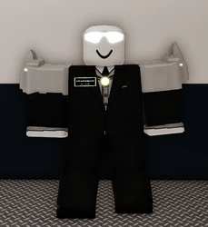
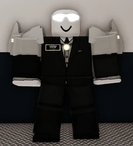
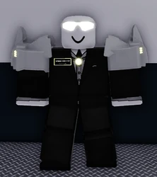
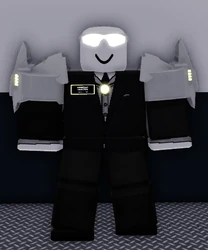
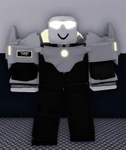
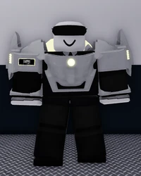
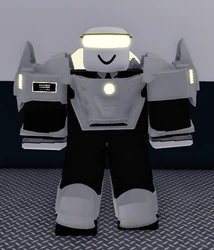
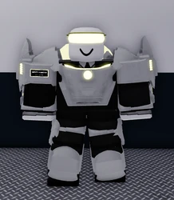
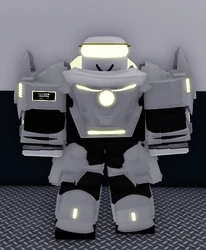
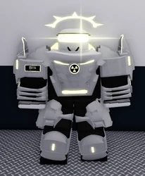

# Facility Director

---

## Gamepass Cost

**3400 Robux** :contentReference[oaicite:1]{index=1}

---

## Team Category

**Facility** :contentReference[oaicite:2]{index=2}

---

## Team Subcategory

**Executive** :contentReference[oaicite:3]{index=3}

---

## Team Type

**Leadership** :contentReference[oaicite:4]{index=4}

---

## Team Details

### Spawn Location

**Executive Offices** :contentReference[oaicite:5]{index=5}

### Keycard Level

**6** :contentReference[oaicite:6]{index=6}

### Weapons

Golden F2000, Golden Desert Eagle, Golden Barrett 50 Cal, Saber. :contentReference[oaicite:7]{index=7}

### Additional Items

Launch Keycard, Green Flare, Flashlight, Handcuffs, ID Card, Facility Control Tablet, Radio :contentReference[oaicite:8]{index=8}

### Pylon Controls

**Yes** :contentReference[oaicite:9]{index=9}

### Elevator Controls

**Yes** :contentReference[oaicite:10]{index=10}

---

## Overview

The Facility Director commonly shortened to (FD) is an executive facility team that is in command of the entire facility. They are the highest rank in the facility, above Council Executives. FDs can access any team locker and can open doors without the need for a keycard, as well as being able to broadcast announcements without being in the Broadcast Room using the Facility Control Tablet. :contentReference[oaicite:11]{index=11}

---

## Equipment

### Weapons

The Facility Director has access to a variety of weapons, such as:
- Gold F2000
- Gold Barrett 50 Cal
- Gold Deagle
- Saber

They also have energy weapons such as:
- Energy PLMG
- Energy BPS
- Energy TPPS

Additionally, they have access to Council Executive weapons in the executive armory. :contentReference[oaicite:12]{index=12}

### Starter-Items

They possess:
- Facility Control Tablet  
- Level 6 keycard  
- Green flare  
- Handcuffs  
- Flashlight  
- Radio  
- Executive ID  
- Launch keycard :contentReference[oaicite:13]{index=13}

---

## Gameplay

The Facility Director spawns in the SCC (Strategic Command Center) in the Director’s Office.  
The Facility Director has access to everything in the facility, excluding admin areas. They have the strongest facility weapons in the game, so they often defend the facility from raiders. They also can make announcements and change the alert level of the facility. Additionally, just like the Council Executives, they have access to the Master Teleporter room.

The gamepass also allows players that have bought it to obtain director items from the armory, even if they are not on the Facility Director team. It also unlocks access to all executive vehicles. :contentReference[oaicite:14]{index=14}

---

## Team Promotions

| Level | Role Image | Visual Changes | Statistical Changes |
|-------|------------|----------------|---------------------|
|1 (Affiliate Director)|  | Black suit, white armor on back, two white pauldrons (each with a glowing white stripe), glowing white shades, white glowing core, white-outline nametag with rank | Unlocks Gold Barrett 50 Cal, Gold Deagle, Gold F2000. Can use Director Armory (Energy PLMG, Energy BPS, Energy TPPS). |
|2 (Associate Director)| | Slightly more armored pauldrons, additional stripe, bright yellow stripes/core/nametag | No change |
|3 (Interim Director)| | Additional stripe, vibrant yellow details | Unlocks ACR |
|4 (Assistant Director)| | Additional pauldron stripe | No change |
|5 (Provisional Director)| | Additional pauldron stripe, chestplate, white arm cuffs, enhanced back armor with wings, right pauldron nameplate | Unlocks AWP |
|6 (Resident Director)| | Black visor, upgraded chestplate | No change |
|7 (Managing Director)| | Bright yellow visor, kneepads | Unlocks SAR-21 |
|8 (Deputy Director)| | Additional arm/leg armor, glowing chestplate details | No change |
|9 (Executive Director)| | Additional leg armor, arm cuffs, upgraded chestplate, glowing knee pads, neck armor | Unlocks Kel-Tec RFB |
|10 (Principal Director)| | Glowing arm cuffs/pauldrons, upgraded chestplate, radioactive core, white feather particles, glowing left eye spark, halo | Unlocks M98B, Energy PLMG, Energy BPS, Energy TPPS |

*(Images shown above are sample placements — replace with your actual morph images.)* :contentReference[oaicite:15]{index=15}

---

## Trivia

- This is the **most expensive gamepass team** in the game. :contentReference[oaicite:16]{index=16}
